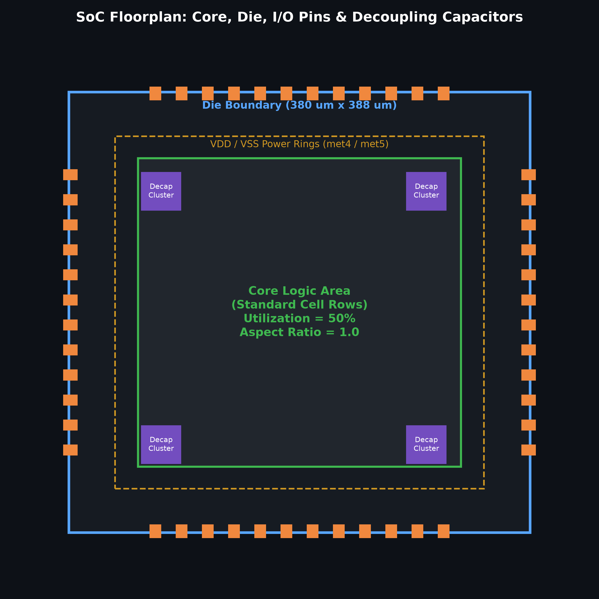
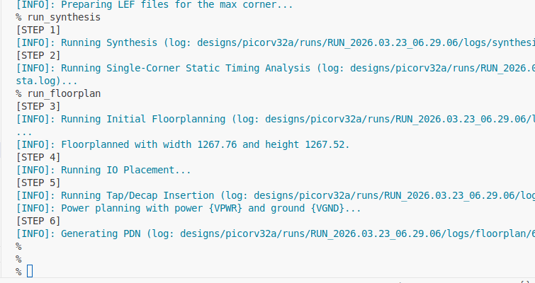
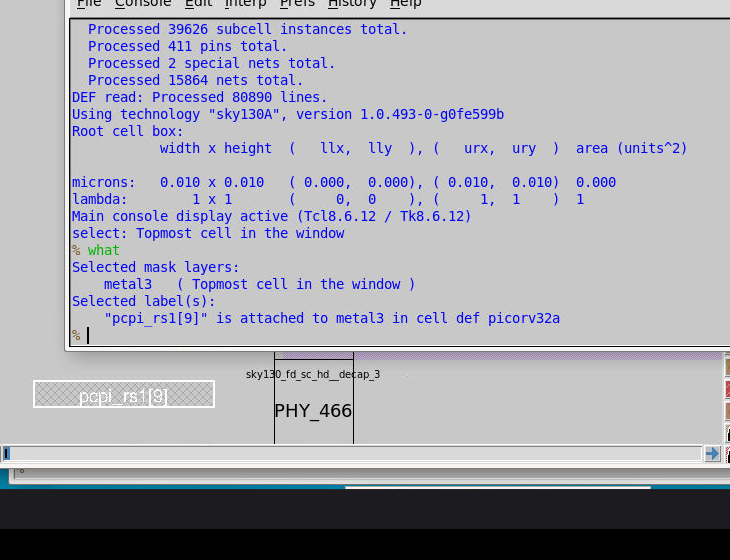
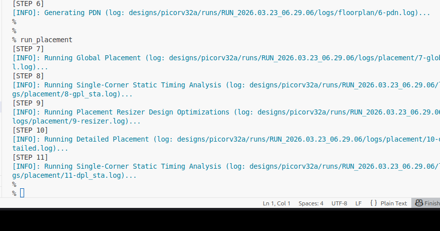
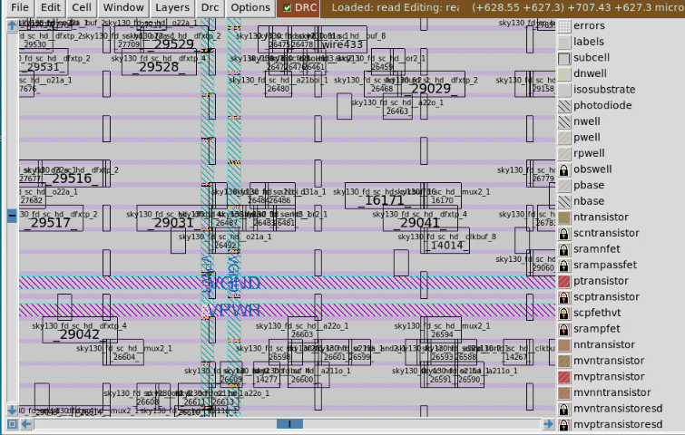

# Day 2: Floorplanning and Introduction to Library Cells

---

## 1. Theoretical Foundations of Floorplanning

### 1.1 Core Utilization and Aspect Ratio
Floorplanning establishes the physical boundaries, shapes, and positions of macros, I/O pads, and power rings.

1. **Utilization Factor ($\text{UF}$)**:
   $$\text{Core Utilization} = \frac{\text{Area Occupied by Netlist Cells}}{\text{Total Core Area}}$$
   In practice, a utilization factor of **$0.50$ to $0.65$ ($50\% - 65\%$)** is chosen. This leaves sufficient routing tracks for interconnects, Clock Tree Synthesis buffer insertion, and timing-driven optimization buffers.

2. **Aspect Ratio ($\text{AR}$)**:
   $$\text{Aspect Ratio} = \frac{\text{Core Height}}{\text{Core Width}}$$
   An aspect ratio of $1.0$ produces a square die, which provides uniform interconnect delays and minimizes diagonal wire length variation.

---

### 1.2 Pre-Placed Cells and Decoupling Capacitors
- **Pre-Placed Cells**: Specialized blocks (SRAM macros, PLLs, analog IPs) are positioned prior to automated placement based on dataflow requirements.
- **Decoupling Capacitors (Decaps)**:
  - During rapid clock switching, simultaneous switching outputs cause large current surges ($di/dt$), producing **voltage droop** on the power supply and **ground bounce** ($V = L \cdot \frac{di}{dt}$).
  - Decaps are high-capacitance physical cells placed immediately adjacent to pre-placed macros. They act as local charge reservoirs to stabilize the local supply voltage rails.

---

### 1.3 Power Planning: Mesh vs. Ring Architecture
- **Power Rings**: Encircle the entire core perimeter with heavy-gauge upper metal layers (e.g., `met4` and `met5`) to distribute $V_{\text{DD}}$ and $V_{\text{SS}}$ around the die.
- **Power Straps / Mesh**: Vertical and horizontal metal stripes crossing the core in a low-resistance grid, connecting the peripheral rings to individual standard cell power rails (`met1`).
- This multi-tier mesh reduces IR drop and mitigates electromigration risk.

---

### 1.4 Pin Placement and Blockages
- Primary input/output pads are placed along the core perimeter.
- Clock pins are positioned equidistant from major sequential blocks to reduce initial insertion delay.
- Placement blockages prevent standard cells from occupying I/O boundary corridors, leaving room for pad drivers and ESD protection circuits.



---

## 2. Lab Execution: Floorplanning and Placement

### 2.1 Running the Floorplan
In the interactive OpenLANE console:

```tcl
run_floorplan
```

This executes `init_floorplan`, `place_io`, and `tap_decap_or`.



### 2.2 Inspecting Floorplan DEF in Magic
The generated Design Exchange Format (DEF) file defines die coordinates, row definitions, and pin locations:

```bash
cd results/floorplan/
magic -T /OpenLane/pdks/sky130A/libs.tech/magic/sky130A.tech \
      lef read ../../tmp/merged.nom.lef \
      def read picorv32a.floorplan.def &
```

Key observations:
1. Standard cell placement rows are aligned horizontally across the core.
2. Well-tap cells and decap cells are inserted at regular intervals to prevent CMOS latch-up.
3. I/O pins are placed along the core boundaries at specific layer pitches.
4. Core-to-die boundary spacing accommodates pin buffers and power ring delivery channels.



---

### 2.3 Running Standard Cell Placement
Standard cell placement is executed in two phases:
1. **Global Placement**: Cells are distributed across the core to minimize total Half-Perimeter Wire Length (HPWL). Cells may initially overlap.
2. **Detailed Placement**: Legalizes cell placement by snapping cells into standard cell rows without overlaps, observing site rules and orientation.

```tcl
run_placement
```



### 2.4 Viewing Legalized Placement in Magic

```bash
cd results/placement/
magic -T /OpenLane/pdks/sky130A/libs.tech/magic/sky130A.tech \
      lef read ../../tmp/merged.nom.lef \
      def read picorv32a.placement.def &
```

All 15,762 standard cells are snapped to row sites with zero overlap, verified against design rules.


