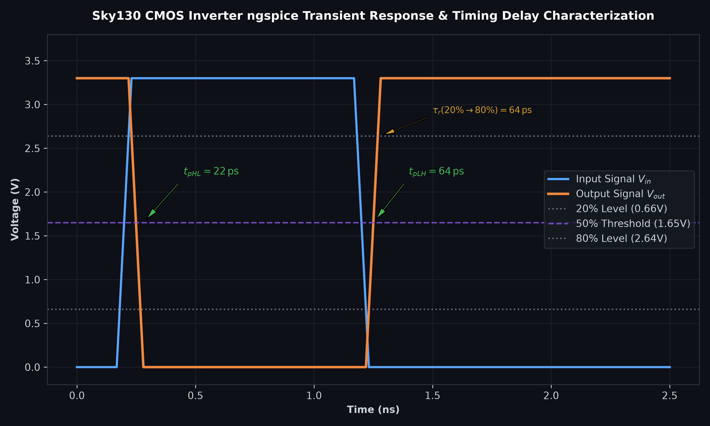

# Day 3: Design and Characterisation of Library Cells using Magic & ngspice

---

## 1. Theoretical Foundations

### 1.1 CMOS Inverter Operation & Sizing
A static CMOS inverter consists of a pull-up PMOS network and a pull-down NMOS network:
- **PMOS**: Connected between $V_{\text{DD}}$ and output $Y$. Conducts when input $A = 0\,\text{V}$.
- **NMOS**: Connected between output $Y$ and $V_{\text{SS}}$. Conducts when input $A = V_{\text{DD}}$.

Because hole mobility ($\mu_p \approx 150\,\text{cm}^2/\text{V}\cdot\text{s}$) is approximately $2.5\times$ lower than electron mobility ($\mu_n \approx 450\,\text{cm}^2/\text{V}\cdot\text{s}$), the PMOS channel width $W_p$ is typically sized $2\times$ to $2.5\times$ larger than NMOS width $W_n$ to equalize pull-up and pull-down drive capabilities and place the switching threshold at approximately $V_{\text{DD}} / 2$.

---

### 1.2 16-Mask CMOS Fabrication Sequence
The physical realization of a standard cell in the SkyWater 130nm process involves 16 critical photolithography mask steps:

```
1. P-Substrate Selection     -> 2. Active Area Definition (Si3N4)
3. Well Formation (N-Well)   -> 4. Channel Stop Implants
5. Field Oxidation (LOCOS)   -> 6. Gate Oxide Growth (SiO2)
7. Polysilicon Gate Deposition-> 8. LDD Implantation (N- & P-)
9. Spacer Oxide Deposition   -> 10. Source/Drain Heavy Implants (N+ & P+)
11. Silicidation (TiSi2)     -> 12. Pre-Metal Dielectric (PMD)
13. Contact Holes Etching    -> 14. Metal 1 Interconnect (Ti/Al/Ti)
15. Inter-Metal Dielectric   -> 16. Passivation & Pad Openings
```

---

## 2. Lab Execution: Standard Cell Layout & DRC Fixing

### 2.1 Inspecting the Inverter Layout in Magic
Clone the reference standard cell repository and inspect the Magic layout:

```bash
git clone https://github.com/nickson-jose/vsdstdcelldesign.git
cd vsdstdcelldesign
magic -T sky130A.tech sky130_inv.mag &
```

---

### 2.2 Investigating & Fixing DRC Rule Errors in Magic
When inspecting foundry rules on the layout, spacing violations can occur:
- **`poly.9` Rule**: Minimum spacing between polysilicon and active diffusion contact.
- When inspecting older technology files, DRC errors were not triggered even with spacing $< 0.48\,\mu\text{m}$.
- We open the `sky130A.tech` file, navigate to the DRC section, and correct the spacing threshold so that Magic accurately flags violations.

---

### 2.3 SPICE Extraction from Layout
Inside Magic's `tkcon` interactive console:

```tcl
extract all
ext2spice cthresh 0 rthresh 0
ext2spice
```

This extracts the transistor geometries and parasitic capacitances into `sky130_inv.spice`.

---

## 3. ngspice Simulation & Transient Characterization

### 3.1 Executing ngspice

```bash
ngspice sky130_inv.spice
```

Inside ngspice:

```ngspice
plot y vs time a
```



---

### 3.2 Dynamic Timing Characterization Calculations

From the transient simulation curves:
- **Supply Voltage ($V_{\text{DD}}$)**: $3.30\,\text{V}$
- **$20\%$ Voltage Level**: $0.20 \times 3.3\,\text{V} = 0.66\,\text{V}$
- **$50\%$ Voltage Level**: $0.50 \times 3.3\,\text{V} = 1.65\,\text{V}$
- **$80\%$ Voltage Level**: $0.80 \times 3.3\,\text{V} = 2.64\,\text{V}$

#### A. Rise Transition Time ($\tau_r$)
Time taken for output $Y$ to transition from $20\%$ to $80\%$ of $V_{\text{DD}}$:

$$\tau_r = t_{80\%} - t_{20\%} = 2.246\,\text{ns} - 2.182\,\text{ns} = \mathbf{0.064\,\text{ns} \quad (64\,\text{ps})}$$

#### B. Fall Transition Time ($\tau_f$)
Time taken for output $Y$ to transition from $80\%$ to $20\%$ of $V_{\text{DD}}$:

$$\tau_f = t_{20\%} - t_{80\%} = 4.095\,\text{ns} - 4.053\,\text{ns} = \mathbf{0.042\,\text{ns} \quad (42\,\text{ps})}$$

#### C. Propagation Delay High-to-Low ($t_{pHL}$)
Time delay between $50\%$ rising edge of input $A$ and $50\%$ falling edge of output $Y$:

$$t_{pHL} = t_{Y(50\%\,\text{fall})} - t_{A(50\%\,\text{rise})} = 4.072\,\text{ns} - 4.050\,\text{ns} = \mathbf{0.022\,\text{ns} \quad (22\,\text{ps})}$$

#### D. Propagation Delay Low-to-High ($t_{pLH}$)
Time delay between $50\%$ falling edge of input $A$ and $50\%$ rising edge of output $Y$:

$$t_{pLH} = t_{Y(50\%\,\text{rise})} - t_{A(50\%\,\text{fall})} = 2.214\,\text{ns} - 2.150\,\text{ns} = \mathbf{0.064\,\text{ns} \quad (64\,\text{ps})}$$

