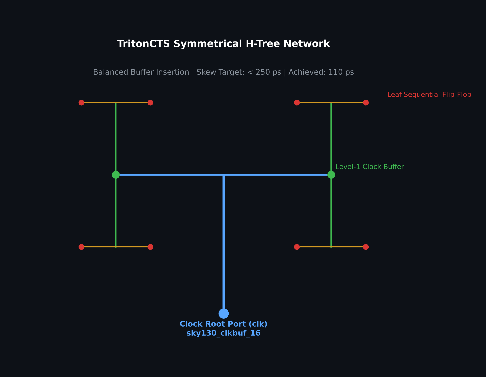
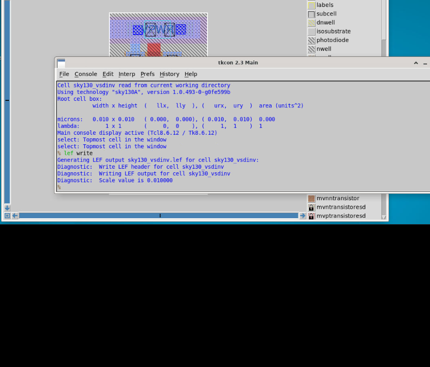
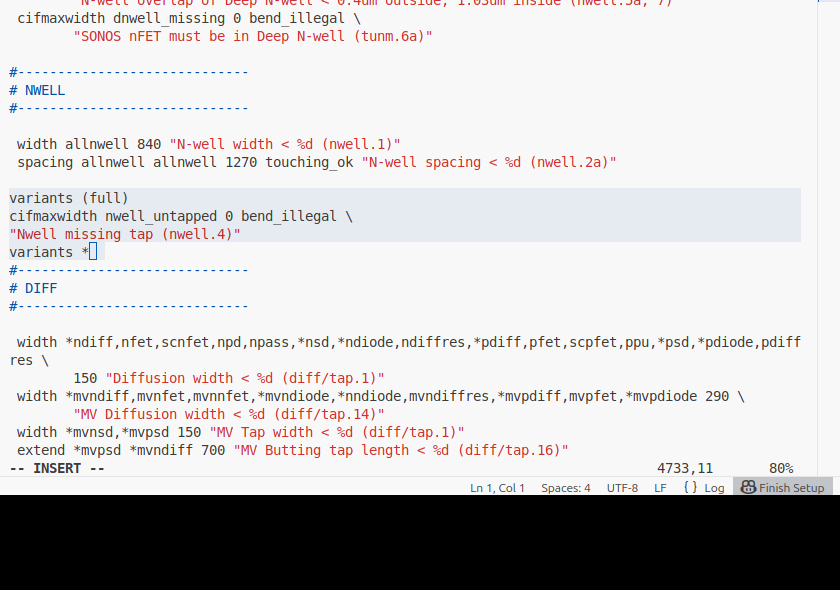
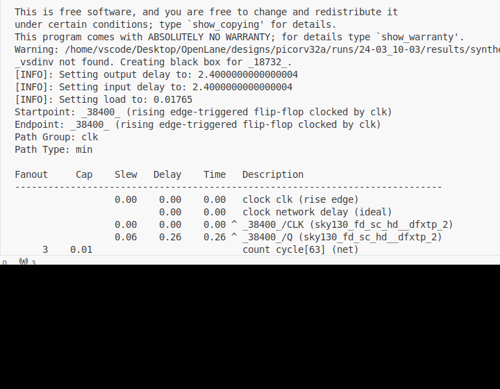
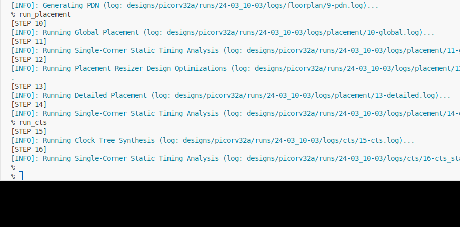

# Day 4: Pre-Layout Timing Analysis and Clock Tree Synthesis

---

## 1. Theoretical Foundations

### 1.1 Standard Cell LEF Physical Guidelines
Before any custom standard cell can be utilized in an automated PnR flow, its physical layout must adhere to strict routing grid rules defined in `tracks.info`:

1. **Routing Track Intersections**: All physical pin ports ($A, Y$) on the local interconnect (`li1`) layer must lie precisely at the intersections of horizontal and vertical routing tracks.
2. **Standard Cell Pitch**: The cell width must be an exact integer multiple of the horizontal track pitch ($0.46\,\mu\text{m}$ for Sky130 `li1`), and the height must be an odd multiple of the vertical pitch ($2.72\,\mu\text{m}$).
3. **Power Rail Abutment**: Power ($V_{\text{PWR}}$) and ground ($V_{\text{GND}}$) rails must lie at the top and bottom edges on `met1` to ensure continuous abutting rails across standard cell rows.

---

### 1.2 Static Timing Analysis (STA) Mathematics
Static Timing Analysis exhaustively verifies that a digital synchronous circuit meets all setup and hold timing constraints across all paths without requiring dynamic simulation vectors.

1. **Setup Time Constraint ($T_{\text{setup}}$)**:
   Data must arrive and stabilize at the capture flip-flop input before the active clock edge:
   $$T_{\text{clk}} + T_{\text{skew}} \ge T_{\text{cq}} + T_{\text{comb}} + T_{\text{setup}} + T_{\text{uncertainty}}$$
   $$\text{Setup Slack} = \text{Data Required Time} - \text{Data Arrival Time} \ge 0$$

2. **Hold Time Constraint ($T_{\text{hold}}$)**:
   Data must remain stable after the clock edge to prevent race conditions:
   $$T_{\text{cq}} + T_{\text{comb}} \ge T_{\text{hold}} + T_{\text{skew}} + T_{\text{uncertainty}}$$
   $$\text{Hold Slack} = \text{Data Arrival Time} - \text{Data Required Time} \ge 0$$

3. **Clock Reconvergence Pessimism Removal (CRPR)**:
   Eliminates artificial timing pessimism when the launch and capture clock paths share common clock tree buffers, as the common path cannot simultaneously experience slow and fast delays.

---

### 1.3 Clock Tree Synthesis (CTS)
CTS constructs a balanced buffer network (typically using an **H-Tree** topology) to distribute the master clock signal from the primary I/O pin to all sequential flip-flops:
- **Clock Skew**: The difference in clock arrival times between any two sequential elements ($\text{Skew} = T_{\text{arrival, max}} - T_{\text{arrival, min}}$).
- **Clock Latency (Insertion Delay)**: The absolute delay from the clock root source to the leaf registers.
- CTS minimizes skew while maintaining clean clock transitions (slew).



---

## 2. Lab Execution: Integrating Custom Standard Cell

### 2.1 Aligning Grid and Writing LEF
In Magic:

```bash
# Check tracks.info
cat /OpenLane/pdks/sky130A/libs.tech/openlane/sky130_fd_sc_hd/tracks.info
```

Set the custom grid in Magic `tkcon`:

```tcl
grid 0.46um 0.34um 0.23um 0.17um
lef write
```



---

### 2.2 Integrating Custom Cell into `picorv32a` Flow
Copy the generated `sky130_vsdinv.lef` and timing libraries (`sky130_fd_sc_hd__*.lib`) to `designs/picorv32a/src/`.



Update `designs/picorv32a/config.tcl`:

```tcl
set ::env(LIB_SYNTH)   "$::env(OPENLANE_ROOT)/designs/picorv32a/src/sky130_fd_sc_hd__typical.lib"
set ::env(LIB_FASTEST) "$::env(OPENLANE_ROOT)/designs/picorv32a/src/sky130_fd_sc_hd__fast.lib"
set ::env(LIB_SLOWEST) "$::env(OPENLANE_ROOT)/designs/picorv32a/src/sky130_fd_sc_hd__slow.lib"
set ::env(LIB_TYPICAL) "$::env(OPENLANE_ROOT)/designs/picorv32a/src/sky130_fd_sc_hd__typical.lib"
set ::env(EXTRA_LEFS)  [glob $::env(OPENLANE_ROOT)/designs/$::env(DESIGN_NAME)/src/*.lef]
```

Re-run synthesis and placement. Open the DEF file in Magic and verify the custom inverter `sky130_vsdinv`:

```bash
magic -T sky130A.tech lef read merged.nom.lef def read picorv32a.placement.def &
```

Use `expand` in Magic to inspect the internal layers of `sky130_vsdinv` seamlessly abutted in the standard cell row.

---

## 3. Pre-CTS Timing Analysis & Clock Tree Synthesis

### 3.1 Running OpenSTA Pre-CTS Analysis
Using `pre_sta.conf` and `my_base.sdc`:

```bash
sta pre_sta.conf
```



---

### 3.2 Running Clock Tree Synthesis (TritonCTS)
In the interactive OpenLANE console:

```tcl
run_cts
```

TritonCTS builds the clock buffer tree, reporting clock insertion delay, clock skew, and inserted buffer counts.



---

### 3.3 Post-CTS Timing Analysis in OpenROAD
Launch OpenROAD inside the OpenLANE session:

```tcl
openroad

read_lef /OpenLane/designs/picorv32a/runs/RUN_2026.03.24_15.13.57/tmp/merged.nom.lef
read_def /OpenLane/designs/picorv32a/runs/RUN_2026.03.24_15.13.57/results/cts/picorv32a.def
write_db pico_cts.db
read_db pico_cts.db

read_verilog /OpenLane/designs/picorv32a/runs/RUN_2026.03.24_15.13.57/results/synthesis/picorv32a.v
read_liberty $::env(LIB_SYNTH_COMPLETE)
link_design picorv32a
read_sdc /OpenLane/designs/picorv32a/src/my_base.sdc

# Crucial: enable propagated clock mode post-CTS
set_propagated_clock [all_clocks]

report_checks -path_delay min_max -fields {slew trans net cap input_pins} -format full_clock_expanded -digits 4
```

Post-CTS results show clean timing:
- **Clock Skew**: $0.11\,\text{ns}$
- **Worst Setup Slack**: $+3.8050\,\text{ns}$
- **Worst Hold Slack**: $+0.2360\,\text{ns}$
